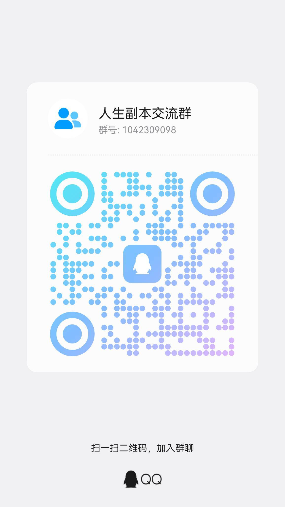

# 人生副本工作台

一个本地 AI 短视频工作台，用于把“人生副本”主题拆成分镜脚本，再生成图片、配音、字幕和 MP4 成片。

项目不绑定具体模型服务，不内置商业生图能力，只提供可替换的接口层。

## 使用声明

本项目主要用于学习交流、技术研究与个人本地测试。使用者如将本项目用于商业场景，需自行确认所接入的模型/API、生成内容及本地素材具备相应商业使用授权；禁止用于任何违法违规场景。

项目代码不包含、也不授权任何第三方音乐、音效、图片、字体、视频、模型服务或平台接口资源。使用者接入的 API、模型、提示词、生成内容及本地素材，均需自行确认来源合法并取得相应授权。

请勿将未获得明确再分发授权的音频、图片、视频等素材提交到公开仓库。因使用本项目或相关素材产生的版权、合规、平台风控及其他责任，由使用者自行承担。

如本项目内容无意中侵犯了你的合法权益，请联系处理。

## 功能

- 口播文案生成：OpenAI-compatible API
- 文案生成：可选 [Sophomoresty/gemini-web2api](https://github.com/Sophomoresty/gemini-web2api)
- 图片生成：OpenAI-compatible Images API
- 可编辑文案提示词：默认读取 `prompt.txt`
- 可编辑图片提示词：默认读取 `prompts/image_style.md`
- 口播转分镜：默认读取 `prompts/copy_to_story.md`
- 高级分镜数据：默认示例读取 `examples/buffet_story.json`
- 仅用主题生成分镜：默认读取 `prompts/story_shots.md`
- 图片批量生成和单张重抽
- 图片失败自动重试，并在分镜卡片显示生成中、重试中、失败状态
- TTS 配音：Edge TTS / MiniMax T2A HTTP
- BGM 与开头音效：内置本地素材选择，支持上传自定义音频到 `workspace/`
- 开头模板：翻页快切、展开快切、横向/纵向羽化快闪、阶梯遮罩接力，模板预览使用固定静态 MP4
- SRT/ASS 字幕
- FFmpeg 合成 MP4（当前默认 1080x1920 / 9:16 画布）

## 快速开始

```bash
pip install -r requirements.txt
python -m uvicorn app.main:app --host 127.0.0.1 --port 7860
```

打开：

```text
http://127.0.0.1:7860
```

## 本地自检

启动服务后可以跑 smoke check，确认接口、项目恢复、前端模块加载、分镜渲染和已有图片 URL 是否正常：

```bash
python scripts/smoke_check.py
```

如果 `.env` 里已经配置好文案和图片模型，也可以同时测试外部连接：

```bash
python scripts/smoke_check.py --external
```

## 环境要求

- Python 3.11+
- FFmpeg / FFprobe in PATH
- Python packages in `requirements.txt`

## 文案接口

普通 OpenAI-compatible 文本接口：

```text
POST {LLM_BASE_URL}/v1/chat/completions
Authorization: Bearer {LLM_API_KEY}
```

网页里填写：

- Provider: `OpenAI-compatible`
- Base URL
- Model
- API Key

也可以复制 `.env.example` 为 `.env` 后填写本地配置。后端启动时会自动读取项目根目录下的 `.env`。

## 提示词

7860 页面里的主流程是：

```text
主题 + 文案提示词 -> 口播文案 -> 自动拆分镜 -> 图片提示词生成分镜图 -> 合成视频
```

页面里可以直接编辑两类提示词：

- 文案提示词：用于“生成口播并拆分镜”，默认来自 `prompt.txt`。
- 图片提示词：用于“批量生成”和“重抽选中图片”，默认来自 `prompts/image_style.md`。

高级区里的“分镜数据”是内部中间数据，用于承接图片和视频流程。通常不需要手写；如果要重新拆分已有口播，可以点“由口播拆分镜”。

## 项目保存

工作台会在外层维护一个当前项目。点击“保存项目”或生成口播、分镜、图片、视频后，会写入：

```text
workspace/projects/{项目ID}/
```

常用文件包括：

```text
state.json
metadata.json
copy.txt
story.json
result.txt
prompts/copy_prompt.txt
prompts/image_prompt.txt
images/
final.mp4
voice.mp3
subtitle.srt
```

刷新页面后会优先恢复当前项目。
顶部项目选择器可以切换已有项目，“新建项目”会创建一个新的当前项目。
图片生成完成后会回填到当前项目的 `story.json` 和 `images/` 目录。

## 前端结构

前端使用原生 ES Modules，入口是 `static/app.js`，其余代码按职责拆到 `static/js/`：

- `api.js`：HTTP 请求封装
- `ui.js`：DOM 查询、状态、设置抽屉、标签切换
- `settings.js`：本地设置、接口配置和请求 payload
- `story-view.js`：分镜 JSON、字数统计、分镜卡片渲染
- `project-store.js`：项目保存、恢复、切换和自动保存
- `workflow.js`：组合各 workflow 子模块
- `workflow-theme.js`：主题策划和主题修订
- `workflow-copy.js`：口播生成和口播拆分镜
- `workflow-image.js`：图片批量生成、并发、重试、重抽
- `workflow-media.js`：BGM/音效上传和开头模板预览
- `workflow-render.js`：异步渲染任务提交、轮询和视频预览
- `workflow-connection.js`：文本/图片接口连通性测试
- `workflow-utils.js`：流程工具函数

## Gemini Web2API

Gemini 文本走 `gemini-web2api`，它本身提供 OpenAI-compatible API。

先单独启动 `gemini-web2api`：

```bash
pip install httpx
python gemini_web2api.py
```

默认服务地址：

```text
http://127.0.0.1:8081/v1
```

工作台里选择：

```text
Provider: Gemini Web2API
Base URL: http://127.0.0.1:8081/v1
Model: gemini-3.5-flash-thinking
API Key: sk-local
```

`.env` 示例：

```text
TEXT_PROVIDER=gemini_web2api
LLM_BASE_URL=http://127.0.0.1:8081/v1
LLM_MODEL=gemini-3.5-flash-thinking
LLM_API_KEY=sk-local
```

`gemini-web2api` 支持的常用模型包括：

```text
gemini-3.5-flash
gemini-3.5-flash-thinking
gemini-3.5-flash-thinking-lite
gemini-3.1-pro
gemini-auto
gemini-flash-lite
```

## 图片接口

图片接口目前只保留 OpenAI-compatible Images：

```text
POST {IMAGE_BASE_URL}/v1/images/generations
Authorization: Bearer {IMAGE_API_KEY}
```

支持响应：

- `data[0].url`
- `data[0].b64_json`

图片尺寸使用比例字符串，不固定写像素：

```text
9:16  竖屏，默认，适合短视频
1:1   正方形
16:9  横屏
```

注意：图片生成比例和成片画布是两个概念。当前成片合成画布仍固定为 `1080x1920`（9:16），横屏或方形图片会被适配进竖屏视频画布。后续如果需要完整横屏成片，需要在渲染配置里新增成片比例/分辨率参数。

生成图片后，工作台会把每个 shot 更新为：

```json
{
  "image_path": "D:\\path\\to\\shot_01.png",
  "image_url": "/workspace/project_id/images/shot_01.png",
  "resolved_image_prompt": "实际发送给图片模型的提示词"
}
```

## 配音接口

默认使用 Edge TTS，无需密钥。需要使用 MiniMax 时，在设置页选择 `MiniMax T2A HTTP` 并填写：

```text
接口地址：https://api.minimaxi.com/v1/t2a_v2
API Key：MiniMax 平台接口密钥
模型：speech-2.8-hd
音色 ID：male-qn-qingse 或其他系统/复刻音色 ID
Group ID：新接口通常留空，旧网关需要时再填
```

MiniMax 使用官方同步语音合成接口 `POST /v1/t2a_v2`，工作台请求非流式 `hex` 音频并写入本地 MP3，再进入后续视频合成流程。

## 音频素材

成片合成支持两类音频素材：

- 背景 BGM：内置目录 `assets/bgm/`，用户上传目录 `workspace/bgm/`
- 开头音效：默认使用 `assets/sfx/gear.mp3`，用户上传目录 `workspace/sfx/`

用户上传音频支持 `mp3`、`wav`、`m4a`、`aac`、`flac`、`ogg`，单个文件上限为 `100MB`。`workspace/` 已在 `.gitignore` 中忽略，上传素材不会进入公开仓库。

## 分镜数据格式

分镜数据是工作台内部承接生图和视频合成的结构。普通使用时不需要手写；页面会在“生成口播并拆分镜”后自动生成。

```json
{
  "title": "自助餐成瘾者回本哥的人生",
  "style_preset": "人生副本视觉风格",
  "shots": [
    {
      "id": 1,
      "voiceover": "今天体验的人生副本是：自助餐成瘾者回本哥的人生。",
      "visual": "他站在自助餐门口，像要参加一场命运审判。",
      "punch": "副本开启",
      "image_prompt": "中文生图提示词",
      "video_prompt": "中文镜头运动提示词",
      "image_path": "可选的本地图片路径",
      "image_url": "可选的浏览器访问地址"
    }
  ]
}
```

## API

```text
GET  /api/example
GET  /api/projects
GET  /api/project/current
POST /api/project/current
POST /api/project/activate
GET  /api/prompt/default
GET  /api/prompt/copy-xianxia
GET  /api/prompt/copy-to-story
GET  /api/prompt/image
GET  /api/prompt/theme
POST /api/text/generate-copy
POST /api/text/generate-theme
POST /api/text/revise-theme
POST /api/text/copy-to-story
POST /api/text/generate
POST /api/llm/generate
POST /api/settings/test-text
POST /api/settings/test-image
POST /api/image/generate-story
POST /api/image/regenerate-shot
GET  /api/bgm
POST /api/bgm/upload
GET  /api/intro-sfx
POST /api/intro-sfx/upload
POST /api/render
POST /api/render/jobs
GET  /api/render/jobs/{job_id}
```

`/api/render` 会输出到：

```text
workspace/{project_id}/final.mp4
```

## 开源注意事项

不要提交 `.env`、API Key、本地生成的 `workspace/`、音频、字幕、视频或任何私有凭据。

## 交流群



## 许可证

MIT
